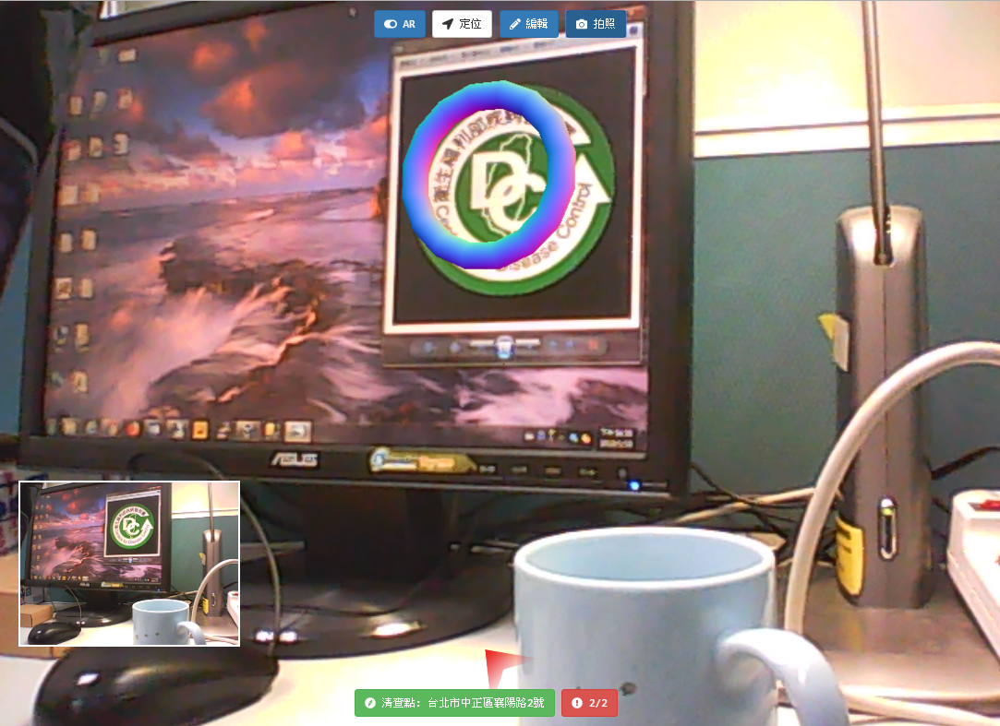

# Taiwan CDC WebAR Pilot Project

Develop a web app for two regular epidemic prevention businesses, collecting the mosquito index and analyzing its data on GIS system. The app integrates several techniques to improve the efficiency on the business for the medical staff, for example, AR, API, GPS, etc. Please enjoy it.

## Tool

* Augmented Reality
  * [A-Frame](https://github.com/aframevr/aframe)
  * [AR.js](https://github.com/jeromeetienne/AR.js)
  * [three.js](https://threejs.org/)
  * [ARToolKit](https://artoolkit.org/)
* Other Framework/Resource
  * [bootstrap](https://getbootstrap.com/)
  * [bootstrap-datepicker](http://bootstrap-datepicker.readthedocs.io/en/latest/)
  * [fontawesome](https://fontawesome.com/)
  * [jquery](https://jquery.com/)
  * [jquery-rotate](http://jqueryrotate.com/)
  * [leaflet](http://leafletjs.com/)
  * [seed](https://github.com/jiankaiwang/seed)
* API Services
  * Google Map API
  * OpenStreetMap
* Camera : [Logitech c170 Webcam](http://support.logitech.com/zh_tw/product/webcam-c170)

## Demo

* Mobile View

* Desktop View

